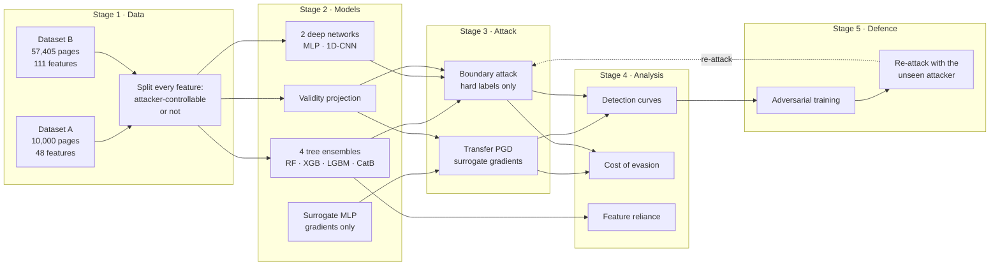
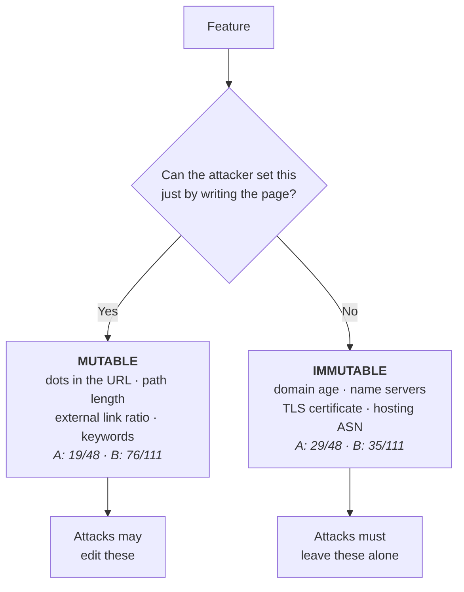

# Accuracy Is Not Robustness

**Realistic Evasion Attacks on Phishing Website Detectors**

[](https://colab.research.google.com/github/Jatinkumar78/Accuracy-Is-Not-Robustness/blob/main/notebooks/accuracy_is_not_robustness.ipynb)
[](https://www.python.org/)
[](LICENSE)
[](paper/paper.pdf)

> Six phishing detectors. Two datasets. Two attackers.
> Every model scores 87–99% on clean data, and that number predicts almost nothing
> about what happens when an attacker starts editing.

---

## The one-paragraph version

Machine-learning phishing detectors are routinely reported at 97–99% accuracy, and on the
usual benchmarks the problem looks solved. This repository tests whether that number
survives contact with an adversary who edits only the parts of a URL and page that an
attacker actually authors. It does not. On one dataset detection collapses from **98.50%
to 66.50%** under a perturbation that leaves the other dataset completely unmoved, and the
same convolutional architecture turns out to be the *most* robust model on one dataset and
the *least* robust on the other. What explains the difference is not the algorithm but
**where the model finds its signal**.

---

## Contents

| Path | What is in it |
|:--|:--|
| `notebooks/` | The full Colab notebook, runs end to end in ~15 minutes |
| `paper/` | The LaTeX source and compiled PDF |
| `results/` | Every measured number as JSON |
| `figures/` | Publication-quality PNG and PDF |
| `models/` | Trained detectors, produced by the notebook |

---

## Quick start

**Fastest route** — click the Colab badge above and press *Runtime → Run all*.
Nothing to upload: Dataset A is embedded in the notebook, Dataset B downloads itself.

**Local:**

```bash
git clone https://github.com/Jatinkumar78/Accuracy-Is-Not-Robustness.git
cd Accuracy-Is-Not-Robustness
pip install -r requirements.txt
jupyter notebook notebooks/accuracy_is_not_robustness.ipynb
```

---

## How the experiment works



### The idea the whole study rests on

Every feature goes into one of two groups.



An attacker *can* change the right-hand column, by registering a domain earlier or buying
different hosting. But that costs money and time, whereas editing markup is free. The
attacks here are only permitted to touch the left column, and every candidate page is
projected back into the space of legal feature vectors before it counts.

---

## Results

### 1. On clean data, everything looks fine

| Model | Dataset A | Dataset B |
|:--|--:|--:|
| Random Forest | 98.50 | 95.71 |
| XGBoost | 98.75 | 94.98 |
| LightGBM | 98.55 | **95.80** |
| CatBoost | 98.65 | 94.55 |
| Deep MLP | 97.40 | 94.87 |
| 1D-CNN | 93.45 | 87.43 |

*Accuracy (%). The four tree ensembles sit inside a band narrower than seed-to-seed noise.*

### 2. Let the attacker edit, and the datasets split apart

| Model | A: clean → ε=0.05 | B: clean → ε=0.05 |
|:--|--:|--:|
| Random Forest | 98.2 → **68.4** | 96.5 → 96.5 |
| XGBoost | 98.9 → **69.3** | 95.3 → 95.3 |
| LightGBM | 98.5 → **69.3** | 96.0 → 96.0 |
| CatBoost | 98.9 → **66.5** | 95.1 → 95.1 |

*Phishing detection rate (%) under the transfer attack. Dataset A collapses at the smallest
budget tested. Dataset B does not move at all.*

### 3. The independent attacker agrees

| Model | A: evadable | A: median L2 | B: evadable | B: median L2 |
|:--|--:|--:|--:|--:|
| Random Forest | 94.8% | 2.64 | **57.8%** | 5.86 |
| XGBoost | 99.0% | 1.85 | 90.0% | 5.85 |
| LightGBM | 99.0% | 2.03 | 80.8% | 5.71 |
| CatBoost | 95.0% | 1.58 | 81.2% | **5.96** |
| Deep MLP | 98.0% | 1.85 | 81.8% | 4.38 |
| 1D-CNN | **70.0%** | 2.50 | 99.0% | 3.54 |

*Median L2 is what the attacker must spend. Higher is more robust. On Dataset B more than
40% of phishing pages cannot be evaded by Random Forest at all.*

### 4. The finding that explains it

| Model | Dataset A | Dataset B |
|:--|--:|--:|
| LightGBM, impurity importance | **76.0%** | **26.9%** |
| LightGBM, permutation importance | 62.1% | — |
| Random Forest, impurity importance | 58.4% | 63.0% |

*Share of the model's decision sitting on attacker-controllable features. The fragile model
draws three-quarters of its signal from territory the attacker owns; the robust one draws
about a quarter. Permutation importance is reported as the conservative check.*

### 5. The defence, including the part that did not work

| Dataset | Clean accuracy | Transfer @ ε=0.3 | Black-box median L2 |
|:--|:--|:--|:--|
| A | 98.55 → 98.65 | 69.3 → **99.7** | 2.03 → **2.84** |
| B | 95.80 → 95.03 | 89.8 → **99.9** | 5.71 → **3.70** ⚠ |

*Adversarial training worked on Dataset A and made black-box evasion **cheaper** on Dataset
B. Measuring only the attack it trained against would have reported a clean win on both.*

---

## What to take away

**Stop quoting accuracy on its own.** Across two datasets it predicted neither the size of
the drop, nor which model held up best, nor whether the defence would help.

**Robustness lives in the feature representation.** The 1D-CNN is the most robust model on
one dataset and the least robust on the other. Same architecture, opposite verdicts.

**There is a number you can measure before you deploy.** Compute the share of your model's
importance sitting on attacker-controllable features. Where it is high, add signals the
attacker cannot fabricate, or regularise the reliance away.

**Test defences with an attack they have never seen.** Otherwise you are measuring
memorisation, not hardening.

---

## Using the trained models

The notebook writes every detector to `models/` as a joblib artefact.

```python
import joblib

model  = joblib.load("models/datasetA_LightGBM.joblib")
scaler = joblib.load("models/datasetA_scaler.joblib")   # models expect standardised input

predictions = model.predict(scaler.transform(X_new))
```

Available: `datasetA_*` and `datasetB_*` for all six detectors, the fitted scalers, and
`*_LightGBM_defended.joblib` for the adversarially trained variants.

---

## Datasets

| | Dataset A | Dataset B |
|:--|:--|:--|
| Source | Tan (2018), Mendeley Data | Vrbančič et al. (2020), *Data in Brief* 33:106438 |
| Link | [mendeley](https://data.mendeley.com/datasets/h3cgnj8hft/1) | [github](https://github.com/GregaVrbancic/Phishing-Dataset) |
| Instances | 10,000 | 58,645 → 57,405 after de-duplication |
| Features | 48 | 111 |
| Schema | URL and page content | URL plus host, DNS and TLS |

Dataset A is embedded in the notebook as a compressed blob with an MD5 check, so it cannot
go missing. Dataset B downloads at runtime with a retry.

---

## Reproducibility

Everything is seeded. A full pass takes about 83 seconds on Dataset A and 209 seconds on
Dataset B on a single CPU core.

One deviation worth stating plainly: on Dataset B the 1D-CNN was trained on a
10,000-instance stratified subsample of the training split to bound its cost. Its absolute
accuracy on that dataset is therefore a lower bound rather than a converged estimate. Every
other number comes from the full training split.

---

## Citation

```bibtex
@inproceedings{accuracy_not_robustness_2026,
  title     = {Accuracy Is Not Robustness: Realistic Evasion Attacks on
               Phishing Website Detectors},
  booktitle = {Proceedings of ICETCS},
  year      = {2026}
}
```

## References

1. Tan, C.L. (2018). *Phishing dataset for machine learning: feature evaluation.* Mendeley Data, V1.
2. Vrbančič, G., Fister, I., Podgorelec, V. (2020). *Datasets for phishing websites detection.* Data in Brief 33, 106438.
3. Brendel, W., Rauber, J., Bethge, M. (2018). *Decision-based adversarial attacks.* ICLR.
4. Madry, A. et al. (2018). *Towards deep learning models resistant to adversarial attacks.* ICLR.
5. Papernot, N. et al. (2017). *Practical black-box attacks against machine learning.* ACM AsiaCCS.
6. Pierazzi, F. et al. (2020). *Intriguing properties of adversarial ML attacks in the problem space.* IEEE S&P.
7. Apruzzese, G., Conti, M., Yuan, Y. (2022). *SpacePhish.* ACSAC.
8. Montaruli, B. et al. (2023). *Raze to the ground.* ACM AISec.
9. Carlini, N., Wagner, D. (2017). *Towards evaluating the robustness of neural networks.* IEEE S&P.

## License

MIT. The two datasets remain under their original licences.
